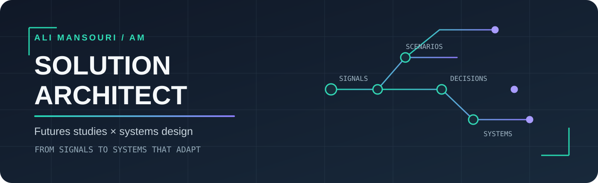
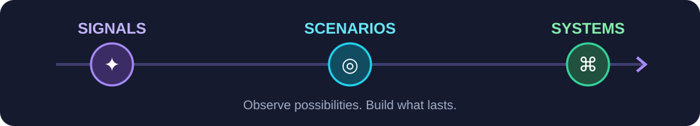
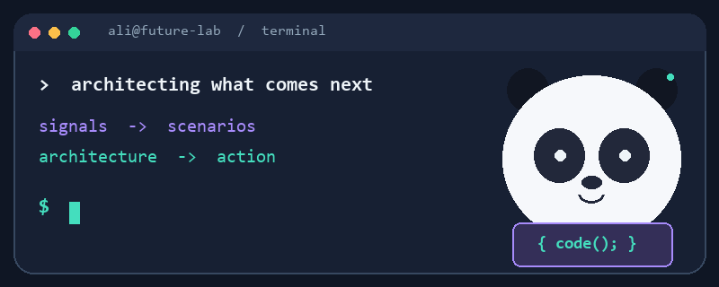

<p align="center">
  
</p>

<p align="center">
  <a href="https://ali-m07.github.io/resume/"></a>
  <a href="https://www.linkedin.com/in/ali-mansouri-a7984215b/"></a>
  <a href="mailto:ali.mansouri1998@gmail.com"></a>
</p>

<h1 align="center">Hi, I'm Ali Mansouri 👋</h1>

<p align="center"><strong>Solutions Architect</strong> · Cloud-Native Systems · Enterprise AI · Strategic Foresight</p>

I am a **Solutions Architect actively exploring international relocation and migration opportunities**. I am open to a suitable job offer with visa or relocation support and willing to move for the right team, problem, and long-term opportunity. Over **5+ years**, I've worked from discovery and systems modeling through Python services, enterprise integrations, Kubernetes deployments, and production AI automation. I turn business goals and constraints into architecture that teams can build, operate, and evolve.

My PhD work in **Futures Studies** adds a longer horizon to those decisions. I study technology megatrends, uncertainty, and the forces shaping future organizations, then use scenario thinking to test architectural choices before they become expensive commitments. The goal is practical: build for today's constraints while keeping tomorrow's options open.

<p align="center">
  
</p>

```python
def my_approach(signal, constraint):
    problem = find_root_cause(signal)
    architecture = design_for_change(problem, constraint)
    return ship_observe_improve(architecture)
```

## What I build

| Architecture lens | In practice |
| :-- | :-- |
| **Cloud-native delivery** | Docker, production Kubernetes, Helm, Terraform, GitHub Actions CI/CD |
| **Enterprise integration** | Jira, GitLab, Confluence, SQL systems, n8n, APIs, identity and access |
| **AI in operations** | LLM workflows, RAG, vector databases, LangChain, document triage |
| **Systems & foresight** | Root-cause analysis, system dynamics, scenario planning, decision pathways |

## How I work as a Solutions Architect

- **Discover before designing:** clarify the business outcome, users, constraints, risks, and measurable definition of success.
- **Translate across boundaries:** connect product, engineering, security, operations, data, and leadership through shared models and explicit trade-offs.
- **Design for change:** choose modular boundaries, integration contracts, observability, and deployment patterns that keep future options open.
- **Make architecture executable:** turn principles into diagrams, ADRs, roadmaps, proof-of-concepts, implementation guidance, and operational ownership.
- **Stay close to production:** validate assumptions with working services, delivery metrics, feedback loops, and post-launch learning.

I am especially interested in roles where architecture sits close to **cloud platforms, distributed systems, enterprise integration, AI enablement, and digital transformation**. I can contribute across the full path from problem framing and target architecture to delivery, adoption, and continuous improvement.

## Futures-oriented perspective

Futures research helps me ask better architecture questions: Which signals should we monitor? Which assumptions are fragile? What happens if regulation, customer behavior, infrastructure cost, or AI capability changes faster than expected? I use horizon scanning, systems mapping, scenario planning, and backcasting to create resilient decision pathways rather than a single brittle forecast.

That perspective complements engineering discipline. A future-ready architecture is not one that predicts the future perfectly; it is one that can sense change early, absorb uncertainty, and adapt without forcing the organization to start over.

## Experience

### Snapp! · Tehran, Iran

**Solutions Architect — Cloud, Systems & AI** · Sep 2025 – Present

- Architect cloud-native internal services on Docker and Kubernetes with Helm, with attention to resilience and repeatable deployment.
- Build Python/SQL services and enterprise identity and authorization flows for a platform serving **1,000+ internal users**.
- Deliver production LLM and RAG automations for document triage; deploy **10+ services** through GitHub Actions CI/CD.
- Lead discovery, architecture, and rollout for digital LMS and HR infrastructure across business units.

**Solutions Architect — Workflow, Systems & Integration** · Nov 2023 – Sep 2025

- Designed Jira workflow automations, data models, and leadership dashboards using ScriptRunner and Jira Assets.
- Connected Jira, GitLab, Confluence, SQL Server, and Recruitee through an integration ecosystem orchestrated with n8n across **6+ APIs**.
- Scoped helpdesk, process, and data platform extensions through fit-gap analysis.

**Solutions Architect — Organizational Systems & P&OD** · Jun 2023 – Jan 2024

- Diagnosed recurring process failures with analytics and systems modeling, then turned onboarding and administrative work into reproducible digital workflows.

### Earlier roles

| Organization | Role | Period | Focus |
| :-- | :-- | :-- | :-- |
| **Bodyspinner** | Data & Systems Analyst · part-time | Nov 2022 – Sep 2023 | Power BI monitoring, ML pricing with CNN/MLflow, ticketing reliability, Jira data quality |
| **Shahrzaad** | Digital Transformation Specialist | Dec 2021 – Dec 2022 | Initial product roadmap, HR workflow digitization, OKRs and KPIs |
| **KarenCrowd** | Business Evaluator & Investment Analyst | Dec 2020 – Dec 2021 | Startup due diligence, valuation, forward-looking risk analysis |

## Selected architecture work

<p align="center">
  
</p>

- **Cloud-native infrastructure:** production Docker/Kubernetes services with Helm and automated GitHub Actions delivery.
- **AI document triage:** LLM, RAG, vector database, and LangChain components orchestrated inside an operational workflow.
- **Enterprise integration:** Jira, GitLab, Confluence, SQL, and n8n connected through governed APIs.
- **Decision support:** Power BI monitoring and CNN/MLflow experiments for pricing optimization.
- **Open work:** [real-time subtitle translator](https://github.com/ali-m07/real-time-subtitle-translator), [Jira MCP guide](https://github.com/ali-m07/jira-mcp-guide), and [Python automation](https://github.com/ali-m07/python-automation).

## Education & research

| Degree | Institution | Years |
| :-- | :-- | :-- |
| **Ph.D. in Futures Studies** · in progress | University of Tehran | 2024 – Present |
| **MBA in Human Resources Management** | Kharazmi University | 2020 – 2023 |
| **B.Sc. in Electrical Engineering** | Qom University of Technology | 2016 – 2020 |

My research covers **technology megatrends, digital entrepreneurship, system dynamics, and future-ready organizations**. The MBA thesis focused on HR technology trends and entrepreneurial opportunities; my electrical engineering project was a GPS design with Arduino.

<details>
<summary><strong>Selected publications and books</strong></summary>

**Articles**

- *Foresight of Entrepreneurial Opportunities in HR in Iran Based on Technology Trends*
- *Challenges in Collaboration Between Accelerators and Digital Startups*
- *Expert vs. Novice: How Experience Influences Startup Evaluation* — final revision
- *The Impact of Perceived Meritocracy and Nepotism on Employee Turnover* — under peer review

**Books**

- *Understanding Entrepreneurial Failure* (co-author, 2023)
- *The Entrepreneurial Journey: From Failure to Success* (co-author, 2024)
- *Digital Entrepreneurship: Management, Systems, and Practice* (co-translator, 2024)

More on [Google Scholar](https://scholar.google.com/citations?user=eM8iwwkAAAAJ&hl=en) and [ResearchGate](https://www.researchgate.net/profile/Ali-Mansouri-33).

</details>

## A little motion from the build log 🐍

<p align="center">
  
</p>

<p align="center"><strong>Open to international relocation for the right job offer</strong> · Remote collaboration welcome · <a href="https://ali-m07.github.io/resume/">Full résumé</a> · <a href="mailto:ali.mansouri1998@gmail.com">Get in touch</a></p>

<p align="center"><sub>Signals → scenarios → architecture → systems that adapt.</sub></p>
