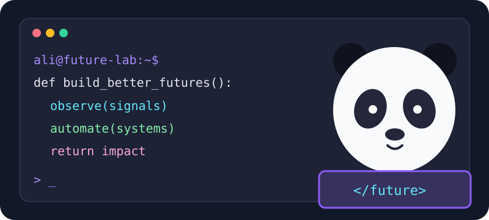

  

  
  
  

<h1 align="center">Architecting systems for futures we can shape.</h1>

<strong>Ali Mansouri</strong> · Solution Architect · Futures Studies PhD Candidate

I turn complex operations into **clear architectures, connected workflows, and measurable decisions**. My work sits at the intersection of enterprise systems, automation, and strategic foresight: understanding what may change, designing for what matters, and building systems that can adapt.

  

## How I think about architecture

| Lens | What I do | What it enables |
| :-- | :-- | :-- |
| **Discover the system** | Map actors, workflows, data, constraints, and failure points | A shared picture of the real problem |
| **Design the architecture** | Define services, integrations, ownership, observability, and change paths | Decisions teams can build and operate |
| **Automate the flow** | Connect APIs, Jira, Python, CI/CD, and reporting | Less manual work and clearer feedback |
| **Test against futures** | Use signals and scenarios to challenge assumptions | Systems with room to evolve |

> **My north star:** useful architecture is as much about people and decisions as it is about technology.

## Where I've put this into practice

- **Snapp! · Systems & Automation Specialist** — workflow automation, Jira ecosystems, KPI dashboards, and operational monitoring across teams.
- **Bodyspinner · Data & Systems Analyst** — a custom Jira-based ticketing platform and automated analytics for service operations.
- **Shahrzad · Digital Transformation Specialist** — redesigned onboarding and OKR workflows.
- **KarenCrowd · Business Evaluator** — used analysis and foresight to evaluate startup opportunities.

## The toolkit

**Architecture & operations** · process mapping, systems integration, Jira administration and automation, BPMS, CI/CD, observability

**Build & analyze** · Python, SQL, C, GitHub Actions, Docker, Power BI

**Exploring now** · Kubernetes, Terraform, AWS, GCP, Grafana

  

## The research behind the systems

I'm a **Futures Studies PhD candidate at the University of Tehran**. I study technology megatrends, digital entrepreneurship, and the future of work. My earlier training spans an **MBA in HRM** and a **BSc in Electrical Engineering**.

My research asks a practical question: **how can today's organizations make decisions that remain useful when tomorrow changes?** That question informs the way I design operations and technology.

<strong>Selected writing and research</strong>

- *Foresight of Entrepreneurial Opportunities in Human Resources in Iran*
- *Challenges in Collaboration Between Accelerators and Digital Startups in Iran*
- Books: *Understanding Entrepreneurial Failure*, *The Entrepreneurial Journey*, and *Digital Entrepreneurship* (translation)

Find more on [Google Scholar](https://scholar.google.com/citations?user=eM8iwwkAAAAJ&hl=en) and [ResearchGate](https://www.researchgate.net/profile/Ali-Mansouri-33).

## A little motion from the build log 🐍

  

Signals → scenarios → architecture → action.

